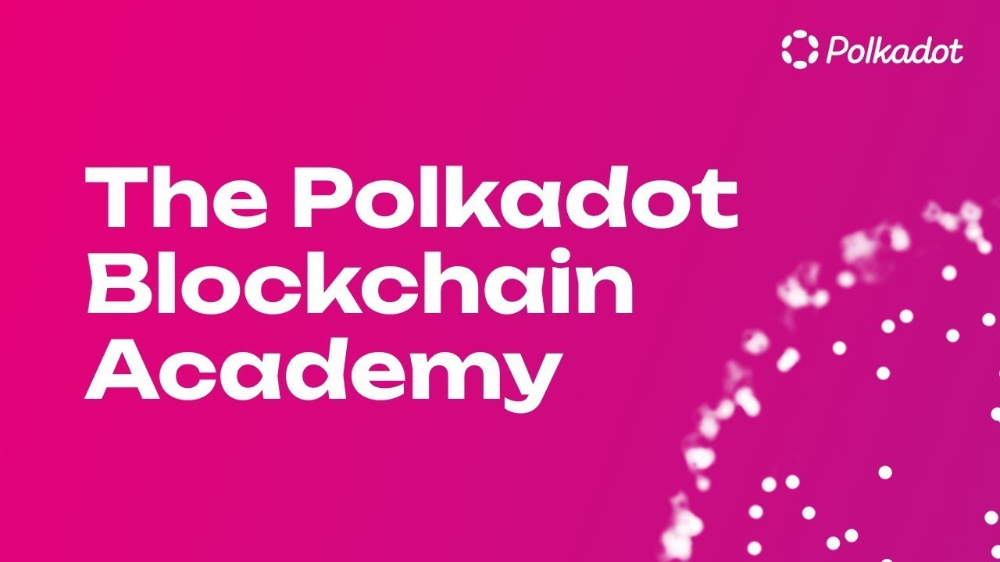
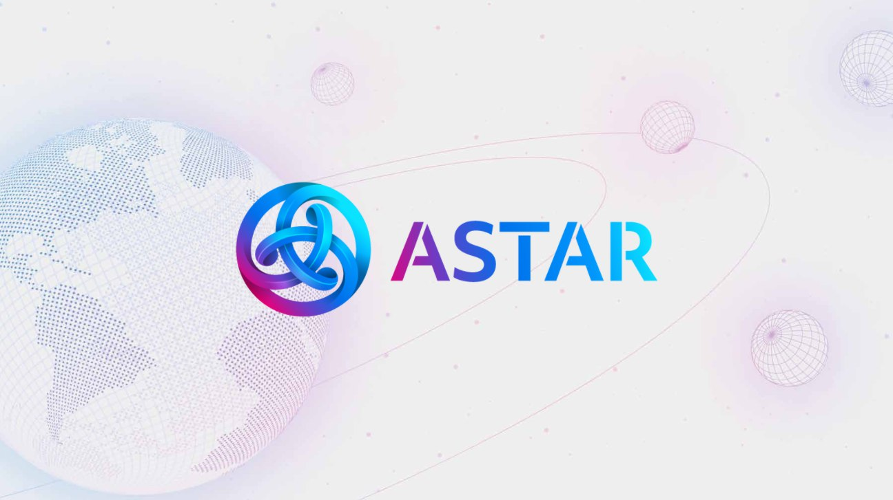
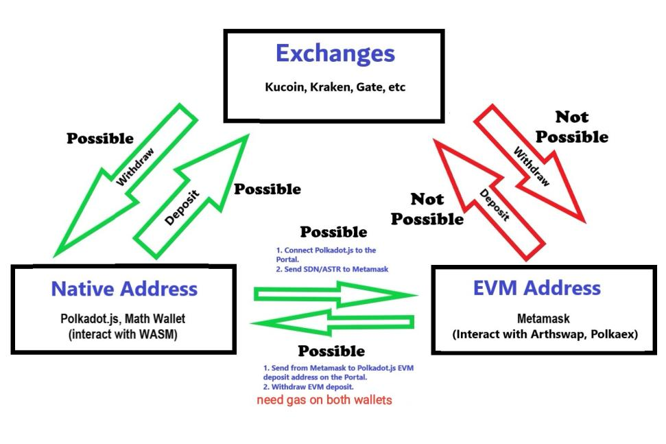
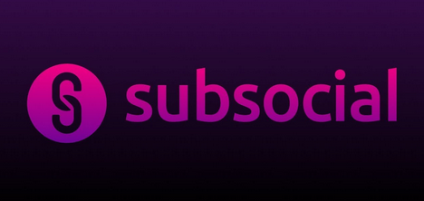
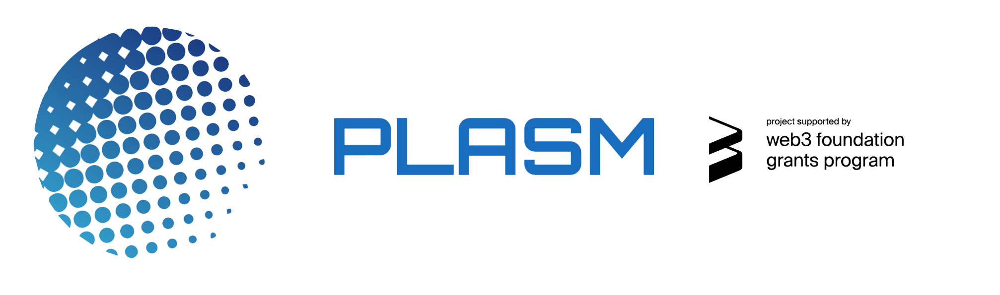
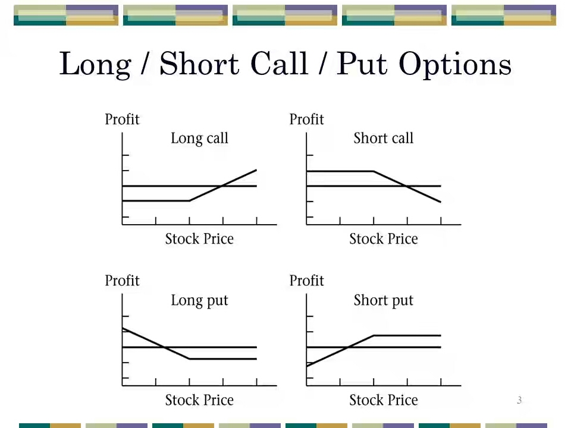

<!--
https://resources.curve.fi/

https://docs.chain.link/docs/running-a-chainlink-node

ChainLink: https://devpost.com/software/ki-dot-a-substrate-based-blockchain-to-help-micro-funding#updates https://docs.chain.link/docs/external-adapters
https://www.smartcontractsummit.io/#videos


Tezos
https://github.com/madfish-solutions/thanos-wallet
https://app.dexter.exchange/

HACKATHON =====> https://www.encode.club/polkadot-club-hackathon <======= HACKATHON

https://docs.google.com/forms/d/e/1FAIpQLSfRk1upWUE3JLQX2UbDj0gXFa_rLcvQhUxPXv3jZJwncOVbLw/viewform

<a href="JOB.md">
  <p align="center">
    
  </p>
</a>

https://bitcoin.sipa.be/miniscript/
https://miniscript.fun
https://dci.mit.edu/smart-contracts 
https://redstone.finance/

Matic: https://www.youtube.com/watch?v=GWUwFDFOipo
https://www.youtube.com/watch?v=pc1yLO56pbg
-->

💡 [I DO recommend!](https://w3f.github.io/w3f-education/docs/introrust) 💡  🧑‍💻 [Rust entry exam](https://github.com/Polkadot-Blockchain-Academy/pba-qualifier-exam) 🧑‍💻

<a href="https://polkadot.network/development/academy/">
  <p align="center">
    
  </p>
</a>

# DAA vol. #26 - Astar Network (ex Plasm Network), Tomasz Waszczyk

<a href="https://astar.network/">
  <p align="center">
    
  </p>
</a>

## :memo: Agenda

* Czym jest Astar?
* Czym jest dApp staking?
* Ekonomia tokenu
* Kamienie milowe
* Co może zrobić programista dla Astar?

## :link: Links

0. https://ncase.me/trust/ - the evolution of trust
1. https://astarhub.io/
2. https://astar.network/
3. https://github.com/diadata-org/diadata
4. https://www.sii.org.pl/14967/edukacja/kurs-kryptowaluty.html
5. https://medium.com/astar-network/astar-launches-the-incubation-program-backed-by-alameda-research-fenbushi-dfg-and-etc-3208349f4cb8
6. Astar Builders: https://share.hsforms.com/1UFPFJXq6S1SN-j1lyMrNIgc2ryh
7. https://tofunft.com/nft/astar/0x1b57C69838cDbC59c8236DDa73287a4780B4831F/5809
8. http://astarbots.com/
9. https://docs.astar.network/tutorial/how-to-send-astr-sdn-from-metamask-to-polkadot.js
10. https://astardomains.network/buydomain#shibuya
11. https://starlay.finance/app
12. https://app.arthswap.org/#/swap
13. https://asteroid.ac
14. Bridge to Astar: https://cbridge.celer.network/#/transfer
15. https://medium.com/arthswap/announcing-arthswap-ido-launchpad-pre-release-campaign-244fa21674a7
16. https://talisman.xyz/
17. https://forum.astar.network/t/individual-claim-on-shiden/2914?u=moonme
18. https://docs.starlay.finance/marketing/ido
19. https://novawallet.io/
20. https://medium.com/astar-network/build2earn-top-astar-projects-for-staking-on-astar-3e6083776fb
21. https://addons.mozilla.org/en-US/firefox/addon/polkadot-js-plus-extension/
22. https://substrate.io/ecosystem/square-one/
23. https://certificate.quantstamp.com/full/arth-swap
24. https://openbrush.io/
25. https://app.subsocial.network/@yoseppy/what-is-astar-who-is-behind-it-and-why-astr-part-2-31327
26. https://drive.google.com/drive/folders/1wdlVeZp6aS3ZqekP0nSwT99WoaWV7KX8
27. https://docs.chain.link/docs/hackathon-resources/
28. https://v2-docs.zksync.io/dev/
29. https://github.com/eth-brownie/brownie
30. https://medium.com/astar-network/using-astar-network-account-between-substrate-and-evm-656643df22a0
31. https://github.com/AstarNetwork/brand-assets
32. https://subwallet.app/
33. https://juicebox.money
34. https://docs.substrate.io/tutorials/work-with-pallets/use-macros-in-a-custom-pallet/
35. https://42.fr/en/the-program/innovative-learning/
36. https://docs.astar.network/docs/wasm/sc-dev/swanky/
37. https://use.ink/why-webassembly-for-smart-contracts/
38. https://solarflare.io/exchange/pool
39. https://docs.openbrush.io/
40. https://global.transak.com/
41. http://www.distributedsystemscourse.com
42. 📝 https://spec.polkadot.network
43. https://substrate-developer-hub.github.io/newsletter/
44. https://polkaverse.com/10647

- https://github.com/paritytech/substrate/issues?q=is%3Aopen+is%3Aissue+label%3AZ1-mentor
- https://github.com/paritytech/polkadot/blob/88d66ac669c5f9c5d82651ff70fda9691f4e0ece/runtime/parachains/src/reward_points.rs#L63
- https://github.com/paritytech/parity-bridges-common/issues?q=is%3Aopen+is%3Aissue+milestone%3A%22When+Thou+Have+Spare+Hour%22


<!-- https://www.evixar.com/ -->

<a href="https://docs.astar.network/tutorial/how-to-send-astr-sdn-from-metamask-to-polkadot.js">
  <p align="center">
    
  </p>
</a>

---
https://eth-converter.com/

https://emn178.github.io/online-tools/keccak_256.html

https://www.epochconverter.com/
---

<!--
LP on dex; arthswap, polkaex
Collateral on Starlay lending
Buy NFTs on Tofunft
-->

---
---
---
---

# SBM vol. #25 - Q&A with Bill Laboon, Tomasz Waszczyk [English]

## :memo: Agenda

During 30 minutes long session, I will ask questions to Bill Laboon regarding Polkadot. Feel free to suggest question via https://github.com/TomaszWaszczyk/silesia-blockchain-meetup/issues/new or just send me via social media.

Recording will be available on YouTube.

## :rocket: Prelegent

*Bill Laboon* is the Director of Education and Community at Web3 Foundation. Before this, he was a lecturer in the Computer Science Department of the University of Pittsburgh, teaching courses in software quality assurance, software engineering, and blockchain technology. He is a frequent speaker at conferences on a variety of topics, including cryptocurrency, software quality, and the ethics of software development. He is the author of two books: A Friendly Introduction to Software Testing, an undergraduate textbook; and Strength in Numbers, a near-future novel set in a world in which cryptocurrency has eliminated traditional money.  Bill has a BS in Computer Science and Political Science from the University of Pittsburgh, as well as an MS in Software Design & Management from Carnegie Mellon University.

## :question: Questions to Bill

1. Do you think that a proxy account in Polkadot is an idea for a business?
2. I understand parathread as a lamba function in Azure, but what is a practical usage in Polkadot? Any practical example?
3. What are current mailstones and goals?
4. DOTs/KSMs collected in crowdloan can be staked by projects?
5. There is a plan for more than two relay chains?
6. [Figment](https://www.notion.so/Polkadot-902169706b8a449cbd6d0b8c9a69249f) - there are any special rules to run WND validator?
7. Onboarding wallet app - do you have some well implemented onboarded app that - I guess that one of the most important thing is to deliver easy way to onboard app.
8. Systems like Polkadot are a new form of (digital) countries - any comment?
9. Does token economy is able to take over the power over individual person? What impact on society has token economy?
10. From your point of view - what is the status of ethics in software engineering today?

## :link: Links

0. https://paritytech.github.io/polkadot/book/
1. https://polkadot.network/
2. https://github.com/TomaszWaszczyk/silesia-blockchain-meetup/issues/new
3. https://www.amazon.com/Strength-Numbers-Cryptocurrency-Bill-Laboon-ebook/dp/B07B75SL2C
4. https://acala.network/acala/quests
5. https://dotmarketcap.com/
6. https://gleam.io/Eonir/polkadot-auctions-crowdloans-and-gifts-campaign
7. https://www.youtube.com/playlist?list=PLxVihxZC42nF_MCN9PTvZMIifRjx9cZ2J
8. https://area51.stackexchange.com/proposals/126136/substrate
9. https://app.subsocial.network/5545/bill-laboon-22986
10. https://github.com/paritytech/substrate-connect
11. https://github.com/w3f/1k-validators-be/pull/1719/files
12. https://www.brightid.org/
13. https://github.com/kabocha-network/relay-chain/tree/v0.9.16-n1
14. https://github.com/paritytech/substrate/pull/11324
15. https://docs.rmrk.app/concepts/
16. https://github.com/paritytech/substrate/issues/11405
17. https://www.popex.net/
18. https://polkawatch.app/
19. https://polkaproject.com
20. https://paritytech.github.io/polkadot/book/index.html
21. https://kusama.subscan.io/xcm_dashboard
22. https://www.notion.so/Community-Events-Bounty-3dc41e32c4f64dc5bee5ad60c3a22432
23. https://pep.wtf/posts/parachains-consensus/


---
---
---
---

# SBM vol. #24 - VisorFinance, Valerio Fichera

## :memo: Agenda

Visor makes & distributes protocol revenue. We are introducing protocol revenue distribution to VISR stakers. It is very important to the future of Visor Finance that stakeholders are rewarded appropriately for their participation. Visor captures fees by taking 10% of the re-invested Uni v3 fees.

## :rocket: Prelegent

*Valerio Fichera*. 

## :link: Links about subsocial.network

- https://www.visor.finance/
- OHM: https://docs.google.com/spreadsheets/u/1/d/15jY82ji22pL5qfDdbh5A6NRy-sbuq2sGwa5DhevWWVY/htmlview

<!--
# SBM vol. #23 - subsocial as an example of Web3, Alex Siman

<p align="center">
  
</p>

## :memo: Agenda

Subsocial is a set of Substrate pallets with web UI that allows anyone to launch their own decentralized censorship-resistant social network aka community. You can think of it as a decentralized version of Reddit or Medium, where a set of subreddits or blogs on Medium run on their own chain.

## :rocket: Prelegent

*Alex Siman* founder of Subsocial and DappForce. We talked about the ideas behing the project, the concept of Subsocial and near future plans. 

## :link: Links about subsocial.network

https://subsocial.network/

https://readymag.com/joaji/parachain/

## :question: Questions

1. Deployment of frontend - does it matter where the frontend is deployed?

2. How consensus in SubSocial is reached? Do you have collators?

3. [curiosity] Have you ever consider to implement "social" pallet? Does it make sense? In the frontend space there are many component so why not here? Maybe, maybe not.

4. [Connections frozen] Some issue with connection to Substrate (remember and research)
-->
---
---
---
---

# SBM vol. #22 - DeFi in Environmental, Social, and Governance operations. Robert Zaremba, Solution Architect, R&D at Regen Network 

## :memo: Agenda

Using distributed ledger technology, satellite remote sensing, and Ecological State Protocols, Regen Network monitors on-the-ground conditions and generates trusted attestations about ecological state. Regen Network provides an open platform designed specifically to run diverse applications such as Regenerative Carbon Credits, Supply Chain Transparency, Reforestation Monitoring, and investment vehicles such as Ecological Bonds. There may be nothing of more critical importance than the regeneration of global ecosystems. Regen Network brings together the tools and communities needed to incentivize actions aligned with planetary health.

## :rocket: Prelegent

*Robert Zaremba* is a Solution Architect & blockchain expert. Being a CTO of startups and working for international companies, he builds products and teams, focuses on delivering and leads by example. Having a solid experience with many projects he is a genuine strategist, advisor and mentor. Today, Robert is actively growing and sharing his knowledge with the community and contributing to thriving projects.

## :link: Links about Regen Network

https://www.regen.network/

https://zaremba.ch/

## :question: Questions

1. Czemu Cosmos a nie Substrate?

2. Są klienci? Jeśli nie to kiedy potencjalnie mogą być?

3. Jakie są insentywy dla walidatorów?

4. Czym jest "carbon credit"?

https://baller.netlify.app/

---
---
---
---

# SBM vol. #21 - Polkadot ecosystem, Substrate, Kusama Network, Sub0 - Tomasz Waszczyk

:tv: :tv: :tv: :tv: Look at in the close time remote conference: https://sub0.parity.io/ :tv: :tv: :tv: :tv:

<p align="center">
  <h2>Internet - The New Jurisdiction</h2>
  
</p>

## :memo: Agenda

What is Polkadot ?

Polkadot is a sharded, multichain network founded by Dr. Gavin Wood, the co-founder and former chief technology officer of Ethereum and creator of the Solidity programming language. After three years of design and implementation, Polkadot is currently in the middle of its mainnet launch process that began in May 2020. The Polkadot network is a metaprotocol that solves many challenges that have hindered the growth of legacy blockchains, including scalability, governance, security, and interoperability. Polkadot is a blockchain network fostered by the Web3 Foundation and built by industry-leading developers at Parity Technologies.

## :rocket: Prelegent

Tomasz Waszczyk - A couple of words about my professional life: I graduated from (but my brain was not broken..) Silesian University of Technology in Poland and Ludwig-Maximilians Universität München - Duales Studium Wirtschaftsmathematik in Germany. At universities I discovered how empowering it can be to build applications and thus built several smaller and bigger applications in different programming languages, domains and platforms from industrial solutions for Volkswagen A.G. to financial solutions for traders in hedge fund.

## :link: Links

:heavy_exclamation_mark::heavy_exclamation_mark::heavy_exclamation_mark::heavy_exclamation_mark: https://www.crowdcast.io/e/substrate-seminar :heavy_exclamation_mark::heavy_exclamation_mark::heavy_exclamation_mark::heavy_exclamation_mark:

https://en.wikipedia.org/wiki/Polka_Dots_and_Moonbeams

https://en.wikipedia.org/wiki/Polka_dot

https://docs.google.com/document/d/1p3UQUjph5t8TVaWnTkfrI5mE-BABnM9Xvtuhdlhl6JE/edit#heading=h.7fq1r3kiaao7

https://playground.substrate.dev/

ink: https://github.com/Supercolony-net/openbrush-contracts

ink: https://docs.openbrush.io/smart-contracts/overview

https://doc.subquery.network/#publish-project-to-the-subquery-explorer

https://polkadot.network/community/

https://www.paka.fund/

https://polkadot.network/

https://github.com/SimplyVC/panic_polkadot

https://w3f-research.readthedocs.io

https://arxiv.org/abs/2005.13456 - "Overview of Polkadot and its Design Considerations"

https://wiki.polkadot.network/docs/en/learn-governance

https://decrypt.co/45168/tokenized-bitcoin-is-coming-to-polkadot-in-q1-2021

https://kusama.network/

https://www.substrate.io/

https://substrate.dev/recipes/introduction.html

https://www.dapp.com/article/dapp-com-support-polkadot-and-kusama

https://medium.com/@KILT_Protocol/a-fundraising-mechanism-for-the-polkadot-ecosystem-62ec23483d57

https://www.kilt.io/polimec/

https://medium.com/coinmonks/polkadot-hello-world-1-cost-effective-cloud-deployment-of-a-validator-node-d3c1bbdb9200

Contact and docs: https://wiki.polkadot.network/docs/en/community#riot-chats

Architecture: https://www.youtube.com/watch?v=xBfC6uTjvbM

New account: https://wiki.polkadot.network/docs/en/learn-account-generation

Consensus: https://wiki.polkadot.network/docs/en/learn-consensus

https://docs.google.com/document/d/1p3UQUjph5t8TVaWnTkfrI5mE-BABnM9Xvtuhdlhl6JE/edit

https://medium.com/polkadot-network/kusama-polkadot-comparing-the-cousins-170e4fe6c280

https://github.com/paritytech/substrate/issues/6845

https://medium.com/@KILT_Protocol/a-fundraising-mechanism-for-the-polkadot-ecosystem-62ec23483d57

https://www.kilt.io/polimec/

https://medium.com/coinmonks/polkadot-hello-world-1-cost-effective-cloud-deployment-of-a-validator-node-d3c1bbdb9200

https://invdos.net/

https://www.youtube.com/watch?v=TgT7laJhxSw

https://expedition.dev/?rpcUrl=https://rpc.testnet.moonbeam.network

https://oneclickdapp.com/

https://scuttlebutt.nz/

https://www.joystream.org/

https://www.chevdor.com/post/2020/01/17/registrar1/

https://github.com/substrate-developer-hub/hackathon-knowledge-map

https://github.com/turboflakes/postmortems

https://www.crowdcast.io/e/polkadot-block-production

## Podcast RelayChain

https://relaychain.fm/ ==> https://www.iheart.com/podcast/269-relay-chain-48876090/

Relay Chain is a podcast covering blockchain development and building the decentralized web. We focus on the cutting edge of blockchain tech, including Substrate and Polkadot.

Brought to you by Parity Technologies, a core blockchain infrastructure company. Parity is creating an open-source creative commons that will enable people to create better institutions through technology.

Really good podcast with best quality knowledge regarding Polkadot ecosystem.

## :rocket: Validator and nomination :rocket:

Kusama network launched in July 2019 as an early, unaudited version of Polkadot’s codebase. The network has increased its validators from 25 at launch to 700 validators, with a motion recently passed that will increase that further to 900. We’re on the way to achieving our original goal of decentralizing Kusama by scaling to one thousand validator nodes. To support Kusama’s validator growth, we launched the Thousand Validators Programme at the beginning of 2020. This programme was extended in December 2020 to allow participants to run multiple eligible nodes. 

<p align="center">
  
</p>

I am honest validator and want to be involved in building healthy network. The name of the validator is `thirdwave-network-validator`.

https://github.com/stakelink/substrate-payctl

## China

https://bootcamp.web3.foundation/

## Polkadot Decoded

https://decoded.polkadot.network/

## :question: Questions

1. W CoinmarketCap widniej Total Suply 9 651 217 KSM. Circulating Supply 8 470 098 KSM a Reported Circulating Supply 8 597 990 KSM. Jak to w końcu jest z ilością coinów w obiegu?
2. j/w - w takim razie skąd biorą się kolejne tokeny? Jest ich z góry ograniczona liczba czy nieograniczona?
3. Slashes - wszędzie jest mowa o tym, że można część środków stracić jako Nominator. Jak wyliczać ryzyko utraty części środków? Czy jest to w ogóle możliwe aby oszacować możliwą stratę? Jeśli NIE to jak system wylicza tą stratę ile obciąć środków?

Odpowiedź: https://w3f-research.readthedocs.io/en/latest/polkadot/slashing/amounts.html

4. W Governance jest Democracy, Council, Tresury. Pare słów o możliwościach. Czy partycypacja w tych funkcjonalnościach może być obligatoryjna czy jest tylko opcjonalna?

Odpowiedź: https://wiki.polkadot.network/docs/en/learn-governance

5. Dla developerów widzę już wiele funkcjonalności - na czym one polegają? czy to głównie łączenie różnych blockchainów przez relay chain?
6. W opisie Polkadot widzę "Polkadot enables cross-blockchain transfers of any type of data or asset, not just tokens." Jeśli nie tylko tokeny to co jeszcze mozna transferować pomiędzy blockchainami? Jakieś przykłady?
7. Walidatorów może być ograniczona liczba, rozumiem że obecnie 600, domyślnie 1000? Natomiast Nominatorów może być dowolna ilość? Choćby tylu ilu posiadaczy KSM/DOT?
8. Jak się ma relay chain Polkadot do relay chain Kusama? Czy to ten sam relay chain czy zupełnie różne?
9. Czy w opłatach za używanie KSM/DOT nie musi być uwzględniona łączna opłata za korzystanie zarówno z sieci KSM/DOT jak również za transakcje w sieciach (blockchainach) w których będą realizowały się jakieś transakcje, np. BTC i ETH ?

---
---
---
---

# SBM vol. #20 - Stateless Ethereum - Tomasz Kajetan Stańczak [Nethermind] 

## :memo: Agenda

Stateless Ethereum - handling the growing state of the Ethereum blockchain
You will learn about inner workings of Ethereum Patricia Trie and Ethereum 2 Sparse Merkle Tree. You will analyze Merkle proofs and Ethereum block witnesses. You will hear about challenges of EVM bytecode merkleization and correct pricing of state touching EVM operations.

## :rocket: Prelegent

Tomasz Kajetan Stańczak - Founder of Nethermind, since 2017 has been working on Nethermind Ethereum and Ethereum 2 Client implementations. Nethermind is an Ethereum Foundation grantee and delivers blockchain software and infrastructure consulting.

## :link: Links

https://eth2.news/

Website: https://nethermind.io/

https://medium.com/nethermind-eth/using-nethermind-to-run-a-validator-in-eth2-5c227653e197

https://github.com/NethermindEth/research/blob/main/legacyTransactions.ipynb

Documentation: https://nethermind.readthedocs.io

Gitter: https://gitter.im/nethermindeth/nethermind

Discord: https://discord.gg/GXJFaYk

Twitter: https://twitter.com/nethermindeth

Releases: https://github.com/NethermindEth/nethermind/releases

Docker: https://hub.docker.com/r/nethermind/nethermind

Codecov.io https://codecov.io/gh/NethermindEth/nethermind

Gitcoin: https://gitcoin.co/grants/142/nethermind

Github: https://github.com/NethermindEth/nethermind/

Github Actions: https://github.com/NethermindEth/nethermind/actions

https://proto.school/#/host

## :question: Questions

0. https://www.trustnodes.com/2020/06/04/powell-backs-ethereum-poa-blockchain-ameribor-for-libor-alternative

---
---
---
---

# SBM vol. #19 - Plasm Network [Polkadot] - Hoon Kim

<p align="center">
  
</p>

## :memo: Agenda

This presentation will act as an introductory point to Plasm Network and Layer 2 scalability solutions as a whole. The contents include, what layer 2 is, what is an OVM, how it provides scalability, what Plasm Network is, what Parity Substrate framework is, what is a Parachain, and how all of this is implemented on Plasm Network.

## :rocket: Prelegent

Hoon Kim, a software engineer at Stake Technologies and a core developer of the Plasm Team.
Awarded Gold Prize at the 2014 South Korean National Olympiad in Informatics. Received the Outstanding Thesis award at Ritsumeikan Asia Pacific University for an undergraduate thesis regarding the applicability of a single purpose blockchain for stock exchanges and asset management (2020).
Graduated Ritsumeikan Asia Pacific University, degree of Bachelor of Business Administration at the College of International Management (2020).

## What is Plasm Network?

Plasm Network is a part (in the near future parachain) of Polkadot ecosystem based on Substrate framework. Main chain (relay chain) in Polkadot due to performance optimizations has only basic features without possibility to execute smart contracts. Plasm Network delivers possibility to working with smart contracts in Polkadot. Using Plasm Network software engineer will be able to deploy DApps on Layer 2 and build own decentralized applications.

## :question: Questions

0. First of all congrats for running mainnet! :rocket: :rocket: :rocket:

0.5. What does Web3 mean for Plasm Network? ;-)

1. Are you going to have own DEX? What about the liquidity provider?

2. As an introduction, could you say about stack technology?

3. Let's talk about the roadmap, "Game development-focused DApps to allow game developers to leverage Plasm Networks’s Layer2 capabilities (ideally a game engine plugin that does not require the developer to know anything about blockchains to use it in their games)." - could you describe a bit more about that, architecture, do you have some draft of API, or just now 'in run-time-meetup' to propose API for that :D ? 

4. What is Dusty network?

5. Polkadot delivers security, pow, consensus and runtime upgrades, so why Plasm Network requires additional validators? Why is that?

6. As added value of Plasm Network is "Dapps as a business", but what is the difference (taking into concideration the following quote):

> “Polkadot allows every coder to also be a businessman. They just place an algorithmic service online and it's a self-sovereign, autonomous, economically strong business. The world, in some sense, belongs to coders.” –– @gavofyork

Why not just:

> Parachain as a business? - Tomek :D :rocket:

7. There is any tocenomy connection between following tokens: DOT, PLM and maybe KSM?

8. "Good actors are rewarded by this mechanism whilst bad actors will lose their stake in the network" - any example for being good and bad actor? As an engineer I am really curious what "bad actor" means :D ?

9. There is any incentive for validator?

10. You are deeply tech guys but for normal people in Japan, what is the awerness of comming token economy? Could you say a few cents on that?

11. Shorty saying.. what milestones and the greatest issues you have while implementating?

12. What have you learnt currently during building parachain? Any advices and/or lessons learned?

13. What is the main advantage of Plasm over Polkadot - from developer point of view?

14. Could you share some your OWN thought on 'scalling Ethereum'?

## !ink

https://substrate.dev/substrate-contracts-workshop/#/0/setup

https://github.com/patractlabs/europa

Here is a sandbox from patract

https://github.com/w3f/PSPs/pull/22

Standards are setting for tokens

https://github.com/patractlabs/ask/blob/master/examples/erc20/index.ts

Also ask is very interesting evolution coming, I’m sure Astar will plan to integrating it soon ^^

https://polkadot.polkassembly.io/post/566

The Métis library from patract is very interesting also

https://docs.patract.io/en/contracts/language

## :link: Links

0. https://github.com/AstarNetwork/growth-program#campaigns-and-tasks

1. https://www.plasmnet.io/

2. https://github.com/staketechnologies

3. https://discord.gg/BfAA6E3

4. https://medium.com/stake-technologies

5. https://twitter.com/hoonsubin

6. Mainnet launch: https://medium.com/stake-technologies/plasm-network-mainnet-launch-6c0372842625

7. https://docs.plasmnet.io/PlasmNetwork/Lockdrop.html

https://docs.google.com/presentation/d/1fD-ecffsDIQHG5eYiOXJ8UXvigyajxDyvDAKMhO47s8/edit#slide=id.g8df8a10daa_0_61

https://docs.plasmnet.io/ecosystem/polkadot

---

https://research.web3.foundation/en/latest/polkadot/NPoS/

Audit: https://github.com/staketechnologies/lockdrop-ui/blob/master/audit/quantstamp-audit.pdf

Wiki: https://docs.plasmnet.io/PlasmNetwork/Lockdrop.html

---
---
---
---

# SBM vol. #18 - Can Bitcoin Reduce Portfolio Risk - Bartek Szyma

<p align="center">
  
</p>

## :memo: Agenda

One major difference in trading Bitcoin options at the moment is the price. Bitcoin is one of—if not the most—volatile asset trading at this time, meaning to buy an option is very expensive. During the meetup we will talk about:

- Available Bitcoin options

- Explaining of CALL and PUT options

- Implied volatility

- Simple strategies and explaining what options offers

## :rocket: Prelegent

Professional investor, programmer, charity worker, journalist. Since 2010 his main source of income is investing. Due to the implementation of the SWAN principle (SleepWellAtNight) and focus on dividend companies, he pursues his second passion - traveling around world. Currently managing investments takes him no more than an hour per week.

## :question: Questions

0. Opcje amerykańskie vs europejskie

1. https://ipfs.io/ipfs/QmWy8x6vEunH4gD2gWT4Bt4bBwWX2KAEUov46tCLvMRcME

## :link: Linki

0. Dividend Kingdom: https://www.facebook.com/groups/usstocksvip/

0. Blog USStocks: https://usstocks.pl/

1. https://www.cmegroup.com/trading/equity-index/us-index/bitcoin_quotes_globex_options.html

2. https://www.hegic.co/

3. https://opyn.co/#/

4. https://lnmarkets.com/

5. https://lnpay.co/t/2b2361/web

6. https://www.deribit.com/

7. https://hegic.gitbook.io/start/

<details><summary>More about Hegic Protocol</summary>
<br>
On April 23rd, Hegic announced the V1 launch of its protocol, which allows users to buy or sell American put/call options on Ethereum. We first wrote about Hegic on March 20th in our Thematic Report on Insurance Products. In that report, we also highlighted Opyn, a similar on-chain options protocol. What differentiates Hegic though, is how it writes (sells) options by implementing liquidity pools.

Hegic has two types of users - 1) holders of options (buyers) and 2) liquidity providers (sellers). When traders typically sell an option contract, the risk they're exposed to is limited to that specific contract. With Hegic, however, the goal is to diversify that risk across all of the liquidity providers for a given pool. Rather than having a single trader be exposed to the risk of a single contract, LPs now share the risk and reward for all contracts issued off their pool. The tables shown below from Hegic's whitepaper illustrate this principal.

<p align="center">
  
</p>

A Hegic token is also expected to launch soon, which will be entitled to protocol settlement fees in contrast to the option premiums that LPs earn. In addition, the token will be used for governance and it'll give option buyers a discount on premiums paid (initially 30%) if the value of the tokens they hold exceeds the value of the contract they want to purchase.

While certainly an interesting idea, will Hegic's design prove to be an innovation with material benefits? This will depend on a variety of factors. How will yields compare to other liquidity pools? How will prices compare to other options exchanges? What is the true risk profile of being a liquidity provider? To answer these questions, our team will be doing a deep dive into the protocol to conduct further analysis. We'll keep our members posted. 

</details>

---
---
---
---

# SBM vol. #17 - Smart Contract Security Verification Standard - Damian Rusinek

## :memo: Agenda

The presentation focuses on the whole process of security testing and present it by analogies to the web applications which are quite well-known. It covers the whole SDLC and show the similarities and differences in the arsenal of vulnerabilities, security tools and standards between the smart contracts and web applications on each step. Even though there exist a lot of great security projects for smart contracts, we do not have single, widely accepted security standard (such as ASVS in web apps world). That is why we introduce SCSVS (Smart Contract Security Verification Standard), a open-source 13-part checklist created to standardize the security of smart contracts for developers, architects, security reviewers and vendors.

## :rocket: Prelegent

Damian Rusinek

Senior IT Security Specialist, since 2016 in SecuRing. Professionally responsible for web and mobile application audits and source code analysis. Software developer and analyst with over a decade of experience. Mainly focused on the cryptographic protocols and distributed ledger technologies and applications that use them.

Finished PhD at Warsaw University of Technology. Damian works as researcher at Maria Curie Sklodowska University in Lublin where his main topic of research are biocrypto and blockchain based protocols and applications. Author of several academic research papers and speaker at such conferences as Cryptography and Security Systems, International Science Conference on Computer Networks, Confidence, Confidence London, AppSec EU, InfoShare.

Creator of Ethereum Responsible Disclosure Messenger (https://securing.github.io/eth-rd-messenger/) and co-creator of Smart Contracts Security Verification Standard (SCSVS).

## :question: Questions

0. Is it true that last update was two years ago (SCSVS)?

1. Do you update SCSVS when new features arrives to Solidity?

2. What you think abotu formal verification? (https://en.wikipedia.org/wiki/Symbolic_execution)

3. SCSVS analyses source code or byte code executed on EVM?

4. Have you considered to write similar tool to another chain?

5. SCSVS is completely open source or there are some closed parts?

6. There is any business model? Is it profitable? ;-) #nofreelunch

7. Do you have some thoughts on Eth2.0? Do you know whether smart contracts will need migrate? Rewrite?

8. Which database do you use to keep state? (https://en.wikipedia.org/wiki/Commitment_scheme)

9. 'if you implement randomness correctly' - could you explain it?

10. 'front running in context of security' ?

## :link: Linki

https://swcregistry.io/

https://securing.github.io/eth-rd-messenger/

https://drdr-zz.medium.com/write-ups-and-lessons-learned-from-damn-vulnerable-defi-caa95d2678ec

https://github.com/securing/SCSVS
    
https://www.securing.biz/smart-contracts-security-checklist/index.html
    
https://www.securing.biz/developing-secure-blockchain-applications/index.html

https://www.slideshare.net/wojdwo/webapps-vs-blockchain-dapps-smartcontracts-tools-vulns-and-standards-229586541

---
---
---
---

# SBM vol. #16 - Synthetix Network - Piotr Misiurek

## :memo: Agenda

Synthetix Network - świat syntetycznych instrumentów finansowych na blockchainie

## :rocket: Prelegent

<p align="center">
  
</p>


Programista i startupowiec z ponad 10 letnim doświadczeniem i anarchistyczną duszą. Entuzjasta technologii blockchain, w której zakochał się na jesieni 2016. Od tego czasu był współredaktorem newslettera Blockchain Weekly, współtworzy społeczności entuzjastów blockchaina i kryptowalut w Łodzi oraz Lublinie. Od połowy 2019 roku prowadzi blog www.zrozumiecbitcoina.pl, za który został odznaczony statuetką Społecznika Roku Nexus 2019 na Konferencji Blockchain i Finanse. Od początku roku prowadzi również kanał na YouTube oraz darmowy kurs DeFi Masters, na którym pokazuje jak wykorzystać oparty o blockchain niezależny system finansowy do ochrony swojego kapitału przed inflacją i zwiększenia zysków z kryptowalut.

Twitter: https://twitter.com/PiotrMisiurek

Youtube: https://www.youtube.com/channel/UCvu10PveAPbtpNTYbzLtGAA

Email: piotr@zrozumiecbitcoina.pl

## :question: Questions

1. "synthetic assets" - derywaty? czy inteligentne kontrakty są otwarte które emitują/będą emitować derywaty?

2. skąd płynność? vanilla P2P?

3. jakie widzisz możliwości zbudowania aplikacji dla kodera już DZISIAJ? jakie w przyszłości?

4. jaka jest tokenomika tokenu?

5. 0x vs SNX

6*. "Co doprowadziło do tego, że w akcjach brał udział jeden uczestnik. Który składał oferty wykupu zastawu za bezcen. Ponieważ była to jedyna oferta złożona w aukcji, to system ją akceptował i sprzedawał zastawy za bezcen."

7*. Jakie lekarstwo na MakerDAO, czy widzisz?

8. Syntetyk USA vs DAI?

9. Zastaw nadmiarowy? co to znaczy?

## :link: Linki

http://www.zrozumiecbitcoina.pl

https://www.zrozumiecbitcoina.pl/defi-masters/

https://www.thirdwave.network/articles/how-decentralised-finance-will-change-the-worlds-economy

--

https://synthetix.exchange/trade?base=sBTC&quote=sUSD

https://www.tokensets.com/

https://jbba.scholasticahq.com/article/12270-emerging-regulatory-approaches-to-blockchain-based-token-economy

---
---
---
---

# SBM vol. #15 - BIP324 oraz BIP150 - Bartłomiej (Tony) Sanak

## :memo: Agenda

Anonimowość - Czy jej brak w Bitcoinie?

Poruszymy braki w anonimowości sieci Bitcoin, jak najłatwiej przeprowadzić "atak" by znaleźć dodatkowe informacje o transakcjach i użytkownikach. Czy developerzy Bitcoina starają się zapobiec tym atakom, i w jaki sposób? Porozmawiamy o kilku propozycjach i sposobach przywrócenia anonimowości, jak

-BIP324 - kodowanie wiadomości na warstwie P2P

-BIP150 - autentykacja połączeń P2P

-Dandelion - jak sprawić by transakcje zakwitły?

-Coinjoin (zerolink) - w jaki sposób wysyłać transakcje by nie narazić się na stratę prywatności

-SNICKER - mixowanie coinów bez interakcji?

## :rocket: Prelegent

Bartłomiej (Tony) Sanak jest programistą oraz fanem Bitcoina jako środka do osiągnięcia anonimowości w płatnościach. Na co dzień pracuje w firmie zajmującej się analityką w sieci Bitcoin, w szczególności wykrywaniem nielegalnych aktywności używających Bitcoina. Po pracy zmienia strony i interesuje się systemami anonimizacji transakcji oraz skalowalnością Bitcoina (LightningNetwork). Bartłomiej jest także guest-writerem dla BitcoinMagazine, pisze o tematyce technologii. Na co dzień mieszka w Vancouver i udziela się w lokalnych grupach promujących Bitcoina, w przeszłości co-organizował Crypto@Cracow meetup.

Twitter: https://twitter.com/SanakTony

Youtube: https://youtube.com/channel/UC1rMoMdDtHTXXfRg_iR-QJQ

## :question: Questions

:zero: Jak żyć? 

:two: Adam Back - A New Language for Blockchains @ https://www.youtube.com/watch?v=GS47YxwxAMI <details><summary>Simplicity</summary>

Simplicity, który jest czymś w rodzaju "Assemblera" dla blockchain. W Bitcoinie może się pojawić w 2020+ roku.

Z tego co rozumiem jest to kontynuacja projektu MAST. Język ten jest ogólnie o wiele prostszy od Scripta, ale bazuje na bardzo podstawowych wartościach, więc można z tych "małych cegiełek" tworzyć bardzo różne inteligentne kontrakty, jeśli dobrze wychwyciłem to jest nawet pomysł wprowadzenia zkSnarks, czyli anonimowych transakcji.

Ogólnie Simplicity jest bardzo wydajnym językiem i lekkim (interpreter ma 15KB), programy wydawane przez niego są matematycznie udowadnialne (Podobno bardzo rzadka dziedzina informatyki, można wyliczyć ile pamięci zużyje program itd.).

W przyszłości może znieść potrzebę stosowania Soft Forków, gdyż można po prostu wrzucić kod Simplicity do blockchaina i węzły mające jego obsługę będą mogły go wykorzystywać, co pozwoli o wiele szybciej wprowadzać zmiany w Bitcoinie.

Może podnieść też bezpieczeństwo, np. chroniąc przed złodziejami, gdzie jest system warunków, w której ludzie mogą głosować (?), by złodziejowi nie wysyłać pieniędzy. Tak więc potencjalnie giełdy będą mogły z cold walletów zrezygnować.

Jeśli dobrze zrozumiałem to kod jaki ma być wykonywany (wcześniej podpisany?) nie musi być wysyłany w całości. Powiedzmy, że mamy kod, który wyda nam środki jeśli 2 klucze podpiszą transakcje lub 1 klucz i poczekanie 5000 bloków. Jak rozumiem w Scripts trzeba było taki kontrakt wrzucić na blockchain, a w Simplicity tylko interesujący nas fragment, co pozwoli zredukować ilość marnującej się powierzchni w blokach
</details>

:three: Atak piaskowy na giełdy.

:four: hosted channels??

## ⚪️ Prośba

Parę osób pytało się mnie w jaki sposób może wesprzeć moją inicjatywę, było to bardzo miłe (przyda się do opłacenia faktury meetup.com): https://github.com/TomaszWaszczyk/silesia-blockchain-meetup/blob/master/Inne/support.txt - to plik z adresami na które można podesłać napiwek, naturalnie preferowany BEAM ;-)

## :link: Linki

1. https://bitcoinmagazine.com/articles/snicker-how-alice-and-bob-can-mix-bitcoin-with-no-interaction

2. https://bitcoinmagazine.com/articles/bip-324-a-message-transport-protocol-that-could-protect-bitcoin-peers

3. https://bitcoinmagazine.com/articles/anatomy-anonymity-how-dandelion-could-make-bitcoin-more-private

4. https://bitcoinmagazine.com/articles/nopara73-on-wasabi-wallet-and-the-quest-for-bitcoin-privacy

http://bitcoin.sipa.be/miniscript/

https://ethereum.stackexchange.com/questions/326/what-are-the-pros-and-cons-of-ethereum-balances-vs-utxos

Satoshi: https://bitcointalk.org/index.php?action=profile;u=3;sa=showPosts;start=520

https://bitcoinmagazine.com/articles/what-we-can-learn-about-lightning-from-lntrustchain2-part-2
<!--
Ustawiać jak najwięcej połączeń dla klientów
SPV nie gra roli kiedy nie ma własnego noda
CoinJoin
BIP75
Blockstream green
Shlomi Zeltsinger
UTXO jest trudniejszy do śledzenia niż model account jak w Ethereum
https://bitcoinmagazine.com/articles/how-the-new-erlay-protocol-could-speed-up-the-bitcoin-network
Cold Card wallet 
Huobi..
-->

---
---
---
---


# SBM vol. #14 - Decentralized exchange - bisq.network

## :memo: Agenda

18.15 Rejestracja uczestników spotkania

18.30 Otwarcie spotkania - Tomasz Drzewiecki, Tomasz Waszczyk

18.35 Decentralized stock exchange - bisq.network, Bernard Łabno

~19.45 Zakończenie spotkania

## :rocket: Prelegent - Bernard Łabno

Jestem takim sobie zwykłym programistą. Hobbistycznie programuję od 2000 roku, zawodowo od 2004. Prowadzę też małą firmę programistyczną.

Co nieco udzielałem się w projektach open-source, takich jak RichFaces, Arquillian i Bisq.
Obecnie jestem związany z tym ostatnim.

## :page_with_curl: Description

1. Czym jest Bisq, w jaki sposób dba o anonimowość i bezpieczeństwo uczestników transakcji

2. Zagrożenia i środki zaradcze

2. Przeprowadzenie rzeczywistej transakcji

3. Jak działa Bisq DAO, zostań kontrybutorem

## :question: Questions

:zero: Jak wygląda order book?

## ⚪️ Prośba

Parę osób pytało się mnie w jaki sposób może wesprzeć moją inicjatywę, było to bardzo miłe (przyda się do opłacenia faktury meetup.com): https://github.com/TomaszWaszczyk/silesia-blockchain-meetup/blob/master/Inne/support.txt - to plik z adresami na które można podesłać napiwek, naturalnie preferowany BEAM ;-)

## :link: Linki

1. https://bisq.network

2. https://www.labnoratory.com

3. https://www.historia.waszczyk.com/wychowanie-mlodego-czlowieka

4. https://bisq.network/roadmap/

5. https://docs.bisq.network/dao-user-reference.html#bsq-genesis-distribution

6. https://monitor.bisq.network

7. https://bisq.network/blog/the-bisq-dao-manifesto/

---
---
---
---

# SBM vol. #13 - Cezary "lightning" Dziemian - Lightening Network

## :memo: Agenda

17.45 Rejestracja uczestników spotkania

18.00 Otwarcie spotkania - Tomasz Drzewiecki, Tomasz Waszczyk

18.05 Cezary "lightning" Dziemian - Lightening Network

~19.45 Zakończenie spotkania, sesja Q&A

~20.00 Integracja oraz piwo

## :rocket: Prelegent - Cezary "lightning" Dziemian

Jestem programistą z kilkunastoletnim stażem. Zacząłem w liceum od sprzedawania własnych programów na Allegro. Oprócz tego, że pracowałem na etat udało mi się po drodze spłodzić parę fajnych rzeczy jak np. grę Milionerzy Gold Edition, czy bota do automatycznego udzielania pożyczek w serwisie Kokos.pl. Swoją przygodę z Bitcoinem rozpocząłem w 2013 roku w momencie zamknięcia platformy Silkroad przez organy ścigania USA. Początkowo nie angażowałem się w tematykę kryptowalut jako programista. Zachowywałem zdrowy sceptycyzm, ze względu na niską skalowalność jak i konieczność oczekiwania na potwierdzenia transakcji. Uważałem, ze istnieją szanse na rozwój ale nie tak duże, by z krypto wiązać swoją karierę zawodową. Przełom nastąpił gdy w roku 2016 zapoznałem się z technologią o nazwie Lightning Network. Uznałem wówczas, że istnieje całkiem spora szansa na to, że jednak kiedyś w przyszłości krytpowaluty będą nadawały się do płacenia. Od tego momentu zaangażowałem się dość mocno. Założyłem stronę lightningnetwork.pl by podzielić się z innymi ludźmi swoim odkryciem. Później powstała też grupa na Facebooku. Udało mi się również zaimplementować LN na giełdzie BTCDuke, czyniąc tą giełdę pierwszą na świecie, która przyjmuje zarówno wpłaty jak i wypłaty przy użyciu Lightning Network. Stworzyłem również stronę ln.zone, pomagającą tym, którzy chcą przyjmować płatności przy użyciu LN.

## :page_with_curl: Description

Lightning is a decentralized network using smart contract functionality in the blockchain to enable instant payments across a network of participants. How it Works. The Lightning Network is dependent upon the underlying technology of the blockchain.

## :question: Questions

:zero: Znasz może serwis w stylu BTC as a service? Wrzucony blockchain do SQL i można odpalać na takiej bazie zapytania SQL?

:one: Jak lepiej instalować LN - za pomocą Docker czy kompilując (make)? - wady i zalety

:two: Parę lat temu mowiło się, że LTC będzie srebrnym BTC, środowiskiem testowym dla wszystkich większych funkcjonalności dla BTC, czy nie uważasz, że LTC zatrzymało się - rozwój LN dla LTC zatrzymał się mówiąc wprost?

:three: Jest parę implementacji LN (C-Lightning czy lnd), czy polecasz którą? Wiesz może jakie są różnice między nimi?

:four: Co sądzi o Channel Factory? Czy i kiedy to może wejść i czy w ogolę ktoś coś już tworzy w tym kierunku?

:five: Anonimizacja a LN, czy to jest dobry moment na pytanie, czy LN zapewni anonimizację?

:six: Co sądzisz o BIP324?

:seven: BTC a PoS?

:eight: Anonimowość a LN?

:nine: Omówienie pliku konfiguracyjnego LN:

<details><summary>Lightning node customization options</summary>


*rgb*='RRGGBB'::
    Your favorite color as a hex code.

*alias*='NAME'::
    Up to 32 UTF-8 characters to tag your node.  Completely silly, since anyone
    can call their node anything they want.  The default is an
    NSA-style codename derived from your public key, but "Peter Todd"
    and "VAULTERO" are good options, too.

*fee-base*='MILLISATOSHI'::
    Default: 1000.  The base fee to charge for every payment which passes
    through.  Note that millisatoshis are a very, very small unit!
    Changing this value will only affect new channels and not existing ones.
    If you want to change fees for existing channels, use the RPC call
    lightning-setchannelfee(7).

*fee-per-satoshi*='MILLIONTHS'::
    Default: 10 (0.001%).  This is the proportional fee to charge for every
    payment which passes through.  As percentages are too coarse, it's in
    millionths, so 10000 is 1%, 1000 is 0.1%.  Changing this value will only
    affect new channels and not existing ones.  If you want to change fees for
    existing channels, use the RPC call lightning-setchannelfee(7).

*min-capacity-sat*='SATOSHI'::
    Default: 10000.  This value defines the minimal effective channel capacity
    in satoshi to accept for channel opening requests.  If a peer tries to open
    a channel smaller than this, the opening will be rejected.

*ignore-fee-limits*='BOOL'::
    Allow nodes which establish channels to us to set any fee they
    want.  This may result in a channel which cannot be closed, should
    fees increase, but make channels far more reliable since we never
    close it due to unreasonable fees.

*commit-time*='MILLISECONDS::
    How long to wait before sending commitment messages to the peer: in
    theory increasing this would reduce load, but your node would have to be
    extremely busy node for you to even notice.

`
Lightning channel and HTLC options
`

*watchtime-blocks*='BLOCKS'::
    How long we need to spot an outdated close attempt: on opening a channel
    we tell our peer that this is how long they'll have to wait if they perform
    a unilateral close.

*max-locktime-blocks*='BLOCKS'::
    The longest our funds can be delayed (ie. the longest *watchtime-blocks*
    our peer can ask for, and also the longest HTLC timeout we will accept).
    If our peer asks for longer, we'll refuse to create a channel, and if an
    HTLC asks for longer, we'll refuse it.

*funding-confirms*='BLOCKS'::
    Confirmations required for the funding transaction when the other side
    opens a channel before the channel is usable.

*commit-fee*='PERCENT'::
    The percentage of 'estimatesmartfee 2' to use for the bitcoin
    transaction which funds a channel: can be greater than 100.

*commit-fee-min*='PERCENT'::
*commit-fee-max*='PERCENT'::
    Limits on what onchain fee range we'll allow when a node opens a
    channel with us, as a percentage of 'estimatesmartfee 2'.  If
    they're outside this range, we abort their opening attempt.  Note
    that *commit-fee-max* can (should!) be greater than 100.

*max-concurrent-htlcs*='INTEGER'::
    Number of HTLCs one channel can handle concurrently in each direction.
    Should be between 1 and 483 (default 30).

*cltv-delta*='BLOCKS'::
    The number of blocks between incoming payments and outgoing payments:
    this needs to be enough to make sure that if we have to, we can close
    the outgoing payment before the incoming, or redeem the incoming once
    the outgoing is redeemed.

*cltv-final*='BLOCKS'::
    The number of blocks to allow for payments we receive: if we have to,
    we might need to redeem this on-chain, so this is the number of blocks
    we have to do that.

Invoice control options:

*autocleaninvoice-cycle*='SECONDS'::
    Perform cleanup of expired invoices every 'SECONDS' seconds, or
    disable if 0.  Usually unpaid expired invoices are uninteresting,
    and just take up space in the database.

*autocleaninvoice-expired-by*='SECONDS'::
    Control how long invoices must have been expired before they are
    cleaned (if 'autocleaninvoice-cycle' is non-zero).

</details>

## ⚪️ Prośba

Parę osób pytało się mnie w jaki sposób może wesprzeć moją inicjatywę, było to bardzo miłe (przyda się do opłacenia faktury meetup.com): https://github.com/TomaszWaszczyk/silesia-blockchain-meetup/blob/master/Inne/support.txt - to plik z adresami na które można podesłać napiwek, naturalnie preferowany BEAM ;-)

## :link: Linki

https://blog.lopp.net/lightning-network-liquidity-management-guide/

https://docs.lightning.engineering/lightning-network-tools/loop/autoloop

https://breez.technology

https://github.com/bcongdon/awesome-lightning-network#web-interfaces

1. https://www.veriphi.io/the-lightning-conference-2019

2. Dla zainteresowanych historią: https://www.historia.waszczyk.com/

3. https://rawaink.katowice.eu/en/

:four: https://blog.bitmex.com/lightning-network-part-4-all-adopt-the-watchtower/

:five: https://bitcoinmagazine.com/articles/taproot-coming-what-it-and-how-it-will-benefit-bitcoin

:six: KuryLN: https://pollofeed.com/

https://rubin.io/

https://medium.com/digitalassetresearch/a-look-at-innovation-in-bitcoins-technology-stack-7edf877eab14

https://lists.linuxfoundation.org/mailman/listinfo/bitcoin-dev

https://medium.com/blockchain-capital-blog/lightning-is-only-the-beginning-the-emerging-bitcoin-stack-fb6d4aefb664

## :tv: Nagrania Cezarego

* https://www.youtube.com/watch?v=pEpzYMQFrT0

* https://www.youtube.com/watch?v=hgfx8XSr65Y

* https://www.youtube.com/watch?v=4n1d42ZLxEE

* https://www.youtube.com/watch?v=u5WK-kzl5tY

---
---
---
---

# SBM vol. #13 - Ramp Instant - user-friendly, trust-minimised, fiat to crypto

<p align="center">
  
</p>

## Agenda

18.15 Rejestracja uczestników spotkania

18.30 Otwarcie spotkania - Tomasz Drzewiecki, Tomasz Waszczyk

18.35 Ramp Instant - building user-friendly, trust-minimised, fiat to crypto onramp, Przemek Kowalczyk

~19.45 Zakończenie spotkania

## Prelegent

Przemek Kowalczyk

Przemek Kowalczyk is a programmer, econophysicist, and entrepreneur. Formerly a Machine Learning specialist at Boston Consulting Group, Przemek first got involved in blockchain technology while publishing a proposal for a decentralized p2p lending network. He co-established Blockchain Hub Warsaw (http://bhwarsaw.org), a foundation connecting Poland’s leading blockchain teams (including Golem, Ramp and MakerDAO).
In 2017 he co-founded Ramp out of a passion for decentralization and freedom, also has built the first prototype of open banking-blockchain connection. Since then, he is concentrated solely on leading Ramp product team, on the mission of disrupting the centralised fiat-to-crypto exchanges market.

## Description

Ramp Instant - building user-friendly, trust-minimised, fiat to crypto onramp

We now finally see DApps built with a broad audience in mind. It seems we are on the verge of mass adoption, yet we did not nail the most important element of the adoption puzzle: how to onboard a user that doesn’t have any crypto?

The onboarding process is a real pain, as it typically takes nearly 30 steps to complete. Plus, all of the popular onramps today are centralised and custodial. We at Ramp made an attempt to build an easy to use, non-custodial on-ramp that with time can get decentralised.

I will talk about why on-ramps matter, what are the trade-offs of different types of on-ramps and finally present our newest attempt to build the perfect onramp: Ramp Instant, built with smart contracts on top of open banking APIs, meant to boost adoption and soothe onboarding pains.

## Questions

1. What is the impact of 'comming' Ethereum 2.0 for Ramp? There is a need for any migration etc. ?

---

Part 1
https://hackernoon.com/ethereum-development-walkthrough-part-1-smart-contracts-b3979e6e573e

Part 2
https://hackernoon.com/ethereum-development-walkthrough-part-2-truffle-ganache-geth-and-mist-8d6320e12269

Part 3
https://hackernoon.com/ethereum-development-walkthrough-part-3-security-limitations-and-considerations-d482f05278b4

---

## Prośba

Parę osób pytało się mnie w jaki sposób może wesprzeć moją inicjatywę, było to bardzo miłe (przyda się do opłacenia faktury meetup.com): https://github.com/TomaszWaszczyk/silesia-blockchain-meetup/blob/master/Inne/support.txt - to plik z adresami na które można podesłać napiwek, naturalnie preferowany BEAM ;-)

## Linki

1. https://www.ramp.network/

2. https://instant.ramp.network/

3. Dla zainteresowanych historią: https://www.historia.waszczyk.com/

4. https://www.adex.network/

5. [IMPORTANT] MakerDAO: https://slideslive.com/38911619/makerdao-a-new-hope-for-financial-reform

## Eth2.0 - valuable links

1. https://hackmd.io/e4cNiocFTiS67j6yJ_XHPw

2. https://hackmd.io/UzysWse1Th240HELswKqVA

3. https://docs.ethhub.io/other/ethereum-2.0-ama/

# Silesia Blockchain Meetup #12 - Merkle Tree Proof, TecraCoin oraz protokół Sigma

<p align="center">
  
</p>

## Agenda

18.15 Rejestracja uczestników spotkania

18.30 Otwarcie spotkania - Tomasz Waszczyk

18.35 TecraCoin,MTP, Sigma, Przemysław Karda

~19.45 Zakończenie spotkania


Przemysław Karda
Since 2006, he has been associated with the IT market. At the age of 21, he founded the first technology company operating in the UK. A former Polish army officer trained in the US Air Force. The creator of the Business Forces leadership program. The co-owner of Belters sp. z o.o. - one of the largest Altcoin mine in Poland, involved in ICO projects and applications based on blockchain technology. Co founder of TecraCoin. The author of science-fiction book entitled ‘Interregnum’, which was a bestseller in science fiction category in Poland. Traveler, philosopher and entrepreneur.

## Opis prezentacji:
> Dlaczego własny blockchain, czemu PoW i kiedy dPoW.

> Dlaczego protokół prywatności.

> Dlaczego MTP.

> Jakie autorskie implementacje planujemy w TecraCoin.

> Sysem głosowań, crypto-lokata, smart contract, tokeny udziałowe

> Panel inwestora i nowe wllety.

Partnerem spotkania jest https://bithub.pl oraz https://www.ilovecrypto.pl

## Questions

1. Sigma light wallet - is it possible? Is it on the road map, any comment on that?

2. Channel Factory?

3.

## Links

www.tecracoin.io

https://eprint.iacr.org/2018/245.pdf

https://lelantus.io/

https://zcoin.io/wp-content/uploads/2016/11/zerocoinwhitepaper.pdf

https://www.facebook.com/Silesia-Blockchain-Meetup

https://www.meetup.com/Silesia-Blockchain-Meetup/

Sigma: https://eprint.iacr.org/2014/764.pdf

https://twitter.com/aramjivanyan

https://www.fatf-gafi.org/publications/fatfrecommendations/documents/regulation-virtual-assets-interpretive-note.html

https://encyklopediakryptowalut.pl/

https://en.wikipedia.org/wiki/David_Chaum

https://coinmarketcap.com/currencies/zcoin/#ratings


# Sigma

Sigma (Σ) Protocol completely removes the need for a trusted setup, which is a major milestone for any privacy coin. In this design, RSA Accumulators which had previously been used for Zerocoin are replaced with Elliptic Curve Groups. As a side effect, Zerocoin proof sizes are reduced from 25 kB to around 1 kB and mint sizes cut by 75%, making Zerocoin much more scalable. Furthermore, it significantly enlarges anonymity sets (to >16,000 [tbd.]) and increases overall security. The latter is achieved by introducing 256-bit elliptic curves which, in terms of security, are roughly equivalent to 3072-bit RSA as opposed to 2048-bit RSA in use by Zerocoin before.


## Tipbox

Będę wdzięczny za wsparcie (adresy w linku): https://github.com/TomaszWaszczyk/silesia-blockchain-meetup/blob/master/Inne/support.txt


# Silesia Blockchain Meetup #11 - MimbleWimble jako BEAM

<p align="center">
  
</p>

## Agenda

18.15 Rejestracja uczestników spotkania

18.30 Otwarcie spotkania - Tomasz Drzewiecki, Tomasz Waszczyk

18.35 BEAM, MimbleWimble, Tomasz Waszczyk

19.00 [In English] Remote connection with Alex Romanov - Israel based, CTO BEAM

~19.45 Zakończenie spotkania, open bar


## Links

Telegram BEAM Polska: https://t.me/beampl

LinkedIn: https://www.linkedin.com/company/beammw/

Explorer: https://explorer.beam.mw/

Newsletter: https://beamprivacy.substack.com/

Investor: https://recruit-holdings.com

Current work: https://github.com/BeamMW/beam/projects/14

Halving and stats data: https://beamprivacy.community/stats

Alexander Zaidelson, CEO of Beam, on Enhancing Mimble Wimble: https://www.youtube.com/watch?v=wg18qtq8S7A

Alexander Zaidelson Launches Beam: https://www.youtube.com/watch?v=IduWUrsv7_M

BEAM Faucet: https://bitmate.ch/

BEAM Blockchain Data: https://datastudio.google.com/u/0/reporting/1QdpwljUhvum_lT-WJmV29Jdbws-zM0Sl/page/alyh

FAQ: https://www.beam.mw/faq/

https://docs.beam.mw/BEAM_Position_Paper_v0.2.2.pdf

https://beamprivacy.community

BEAM compared to classical MW https://docs.beam.mw/BEAM_Comparison_with_classical_MW.pdf

Battle of the Privacycoins: What We Know About Grin and Beam’s Mimblewimble
https://bitcoinmagazine.com/articles/battle-privacycoins-what-we-know-about-grin-and-beams-mimblewimble/

Comparing privacy coins is hard!: https://medium.com/beam-mw/comparing-privacy-coins-is-hard-2d617f931682

Mimblewimble explained like you’re 12 https://medium.com/beam-mw/mimblewimble-explained-like-youre-12-d779a5bb483d

Mimblewimble metaphor https://medium.com/beam-mw/how-mimblewimble-works-18ea3980cffe

What’s the difference between Monero, Zcash, and BEAM? https://medium.com/beam-mw/whats-the-difference-between-monero-zcash-and-beam-953eafd89354

A Short History of Mimblewimble: From Hogwarts to Mobile Wallets https://medium.com/beam-mw/a-short-history-of-mimblewimble-from-hogwarts-to-mobile-wallets-2514a21debb

Why BEAM is Sound Money https://medium.com/beam-mw/why-beam-is-sound-money-b2d956f18efc

About Dandelion and Mimblewimble https://medium.com/beam-mw/about-dandelion-and-mimblewimble-e083597e0355

Atomic Swaps — The “Holy Grail” of Altcoins https://medium.com/beam-mw/atomic-swaps-the-holy-grail-of-altcoins-17f4c5452e62

Core dev Vladislav Gelfer lecture in Zero-Knowledge Summit # ZK0x02 Berlin
https://docs.beam.mw/Presentation-of-Mimblewimble-at-the-Zero-Knowledge-Proof-Summit-Berlin-September-2018.pdf

Video of Vlad's lecture https://www.youtube.com/watch?v=EX9jQg9tuQc

From Adam and Eve to Facebook, a history of Privacy: https://medium.com/beam-mw/from-adam-and-eve-to-facebook-an-history-of-privacy-42b97de43b6b

Conor O'Higgins, A Beam Ambassador, live on Rise Vilnius FinTech Week https://youtu.be/1HbpGn-HrD4?t=175

From chain to DAG: http://diyhpl.us/wiki/transcripts/scalingbitcoin/tokyo-2018/ghostdag/

https://medium.com/beam-mw/whats-the-difference-between-monero-zcash-and-beam-953eafd89354

[PL] https://steemit.com/polish/@bithubpl/co-to-jest-mimblewimble-or-wiecej-prywatnosci-w-blockchain

https://tlu.tarilabs.com/protocols/grin-beam-comparison/MainReport.html

https://medium.com/@yi.sun/privacy-in-cryptocurrencies-d4b268157f6c

https://www.youtube.com/watch?v=KG13kQRWg98

https://research.circle.com/crypto-reports/mimblewimble

AMA: https://www.youtube.com/watch?v=dm21bOh1TVg

https://www.youtube.com/watch?v=aHTRlbCaUyM

https://medium.com/@brandonarvanaghi/grin-transactions-explained-step-by-step-fdceb905a853

https://github.com/mimblewimble/grin/blob/master/doc/intro.md

# Extra Resources:

Original Mimblewimble paper http://docs.beam.mw/Mimblewimble.pdf

SBBS: https://github.com/BeamMW/beam/wiki/Secure-bulletin-board-system-(SBBS)

Follow up Paper by Andrew Poelstra https://download.wpsoftware.net/bitcoin/wizardry/mimblewimble.pdf

Andrew Poelstra on Mimblewimble https://www.youtube.com/watch?v=aHTRlbCaUyM&t=22s

Andrew Poelstra on Mimblewimble Scriptless scripts https://www.youtube.com/watch?v=ovCBT1gyk9c&t=1s

Jackson Palmer's "What is MimbleWimble? (incl. Grin)” https://www.youtube.com/watch?v=BMiM0rabRjc&t=25s

Meet the CTO of Beam https://cryptopotato.com/the-revolutionary-anonymous-beam-launches-2nd-test-net-special-interview

Mimblewimble, the Good and the Bad https://www.tokendaily.co/blog/mimblewimble-the-good-and-the-bad

A Reply by Alex Romanov https://medium.com/beam-mw/on-linkability-of-mimblewimble-da9ba71e83b4

Tari Labs - Grin vs Beam Comparaison https://tlu.tarilabs.com/protocols/grin-beam-comparison/MainReport.html

Jimmy Song on Mimblewimble https://www.youtube.com/watch?v=fRWf7Hf4czc

Behind Mimblewimble https://medium.com/@jcliff/behind-mimblewimble-cd9da78a00e9?sk=689b5f55fa575e150ca5eae685fc321d

Andreas Antonopoulos on mimblewimble and Dandelion https://www.youtube.com/watch?v=LjDJGTpK_lE

Privacy in Cryptocurrencies: Mixing-based Approaches https://medium.com/@yi.sun/privacy-in-cryptocurrencies-mixing-based-approaches-ce08d0040c88

https://geti2p.net/en/

# Updates

https://documentation.beam.mw/en/latest/rtd_pages/user_atomic_swap.html

# Grin

https://grinscan.net/charts


# Mining pools

https://beam.leafpool.com/

# BEAM's roadmap

https://medium.com/beam-mw/mimblewimble-beam-roadmap-2019-b2c7f38fc106

# Questions

1. In the link: https://medium.com/beam-mw/mimblewimble-beam-roadmap-2019-b2c7f38fc106 is written "To increase adoption and let people run Beam node and wallet on more platforms, such as Rust programming language". Does it mean BEAM will be implemented in Rust? If so what is the advantage of Rust?

2. BEAM wants to change PoW algorithm two times, why? Why DAG like: http://diyhpl.us/wiki/transcripts/scalingbitcoin/tokyo-2018/ghostdag/ ?

3. What is the difference between Tor and I2P network?

4. BEAM is going to implement PoS and/or master nodes?

5. In MW there are no address. So for what block explorer?

# QTUM Hackathon

Some useful link team formation link: https://trello.com/b/g4LHnM5L/2019-qtum-privacy-hackathon-team-formation discord group： https://discord.gg/mFFNZhB Sign up web: https://hackathon.qtum.org/ 
https://hackathon.qtum.org/ 


Contact: howard @ qtum . org


# Silesia Blockchain Meetup #10 - Rav3nPL czyli Rafał Kiełbus o stanie ekosystemu Bitcoin - 03.04.2019


Rafał Kiełbus - Z technologią blockchain i Bitcoinem od 2011 roku. Pierwsze wykopane BTC sprzedawał po 40zł, czego nadal żałuje ale daje pewien dystans do kwestii kursu BTC. Bitcoin Core contributor. Uczestnik pracach Ministerstwa Cyfryzacji w strumieniu „Blockchain i Kryptowaluty” Uczestnik prac nad raportem dot. blockchain i kryptowalut przy KNF. Uczestnik prac Zespołu Parlamentarnego ds. technologii Blockchain i kryptowalut

Afiliacje:

    Izba Gospodarcza Blockchain i Nowych Technologii (Board Member)
    Polskie Stowarzyszenie Bitcoin (member)
    Polskie Forum Bitcoin (Bardzo Zły Moderator)
    Polskie Stowarzyszenie Transhumanistyczne (member)
    Centrum Technologii Blockchain (member)

Autor wielu wystąpień i artykułów pod wspólnym tytułem "Rafał prostuje Bitcoina", m.in na:

    Beer & Bitcoin (wielokrotnie)
    Blockachain Meetup Łódź (wielokrotnie)
    BlockchainTech Congress (1. edycja)
    Digital Money & Blockchain Forum (5. edycja)
    Bitcoin & Blockchain Meetup Opole
    Crypto Congress
    Gorzów IT
    Steem


## Linki

1. Inne prezentacje Rafała: https://github.com/TomaszWaszczyk/silesia-blockchain-meetup/tree/master/3-04-2019/Inne_prezentacja_Rafa%C5%82a

2. https://github.com/domator4x4/TheWalletBot

3. https://en.bitcoin.it

4. https://steemd.com/bitcoin/@rav3npl/rafal-prostuje-bitcoina-robimy-transakcje-hodl

5. https://digiconomist.net/bitcoin-energy-consumption

6. https://medium.com/@spair/an-adaptive-block-size-for-bitcoin-947fbc620c9b

7. https://github.com/iquidus/explorer

8. http://lightening.raven.pl/3d.html

9. https://github.com/lightningnetwork/lnd

10. https://electrum.org

11. "Rafał prostuje Bitcoina" - https://www.youtube.com/playlist?list=PLfblP0xy4AJNb_p78ZIS1JVRenNP6Q02t

12. Torrent: http://www.bittorrent.org/beps/bep_0000.html

13. https://github.com/geraldb/talks/blob/master/blockchain.md

14. http://www.financial-math.org/blog/2016/10/the-mathematics-behind-blockchain

15. http://diyhpl.us/wiki/transcripts/magicalcryptoconference/2019/

16. https://medium.com/@kscarbrough1/blockchain-is-just-one-chapter-in-the-larger-story-being-written-by-cryptography-right-now-a6d6a94ff372

17. https://www.deribit.com/main#/insurance


## Pytania

0. Czy z punktu widzenia protokołu Bitcoin istnieje "Bitcoin" (dane przechowywane w `double` i/lub `long`) oraz "transakcja"? 

1. Możesz wyjaśnić https://github.com/TomaszWaszczyk/silesia-blockchain-meetup/blob/master/Inne/Pictures/number-of-unspent-transaction-outputs.jpg ?

2. Plik `wallet.dat` jaką rolę pełni, da się go odszyfrować, co w nim jest?

3. Unconfirmed transactions oraz fee..

4. Gdzie najłatwiej (i bezpiecznie) dostać się do adresu mają klucz prywatny?

5. Jaka różnica jest pomiędzy UTXO a 'account model'?

6. BTC może zmienić algorytm konsensusu na Byzantine Fault Tolerance? 

7. BTC a komputer kwantowy, czy dla adresu na który jedynie transakcje spływają to jest problem?

8. Jaką można zrobić najmniejszą transakcję przez BTC / LN - w jaki sposób mogę sobie postawić LN - Docker?

9. Governance model in BTC?

10. UTX vs price: https://github.com/TomaszWaszczyk/silesia-blockchain-meetup/blob/master/3-04-2019/utx-vs-price.jpg

11. Z jakich narzędzi korzystasz podczas rozwijania (development, debugging, profiling) etc. etc.?

12. Od czego byś zaczął gdybyś miał zadanie zrobić side chain dla BTC (vide BEAM)?

13. Najmniejsza transakcja w LN to satoshi z satoshi?

# Cross Meetup #5 - JavaScript + Blockchain - 29.03.2019

## Prezentacje

### Michał Załęcki

https://youtu.be/vS0la5W-7L0

https://www.slideshare.net/michalzalecki/how-your-javascript-skills-apply-in-the-blockchain-space

### Krzysztof Kaczor

https://slides.com/krzkaczor


# Silesia Blockchain Meetup #9 - Aeternity oraz Rozliczkryptowaluty.pl - 18.03.2019

* Przemysław Thomann - https://twitter.com/_pthomann

* Łukasz Skonieczny

* Michał Zajda - https://twitter.com/michalzajda

Aeternity - blockchain 3.0 Wprowadzenie do Aeternity - platformy Blockchain trzeciej generacji. Prezentacja projektu i ogólnych koncepcji stojących za Aeternity + wgląd do technologii, narzędzi i rozwiązań ekosystemu Aeternity.

Przemysław Thomann - entuzjasta branży krypto, Web & Blockchain developer z aspiracjami startupowymi. Ostatni rok spędził na rozwijaniu platformy MobyCrypt (https://mobycrypt.com), w założeniu będącą centrum tokenizacji i kryptowalut. Ambasador Aeternity, zaangażowany jako członek społeczności projektu. Rozwija nagrodzony przez Aeternity eksplorator bloków: https//aemonitor.mobycrypt.com W styczniu 2019 miał okazję uczestniczyć z członkami teamu Aeternity w Aepps Summit w Turcji - wydarzeniu dedykowanemu rozwijaniu aplikacji opartych o Aeternity. Blog i więcej info: https://pthomann.pl

Michał Zajda - developer, architekt, team lead. Od kilku lat prowadzi swoją firmę R&D, która bierze udział w projektach technologicznych związanych ze skalowalnością rozwiązań serwerowych. Najciekawsze projekty prowadziliśmy w dziedzinie chatów mobilnych, rynków RTB, IoT czy blockchain. Ostatnie lata, to design i implementacja nowego protokołu blockchain: Aeternity.

ENG: Aeternity - blockchain 3.0 Introduction to Aeternity (https://aeternity.com/) - third generation Blockchain platform. Presentation of project and general ideas standing behind Aeternity + insight of the technology, tools and solutions of Aeternity ecosystem. Bio: Przemysław Thomann Crypto enthusiast, Web & Blockchain developer with startup aspirations. Last year spent on developing MobyCrypt platform (https://mobycrypt.com) - with the initial idea of creating tokenization & cryptocurrency centre. Aeternity ambasador, engaged as the community member of the project. Develops the awarded by Aeternity team blocks explorer: https://aemonitor.mobycrypt.com In January 2019 had the opporutnity to take part together with Aeternity team members in Aepps Summit in Turkey - event dedicated to application development based on Aeternity. Blog and more info: https://pthomann.pl


## Agenda:

18.15 Rejestracja uczestników spotkania

18.20 Otwarcie spotkania - Tomasz Drzewiecki

18.25 https://rozliczkryptowaluty.pl - rozliczanie podatku z kryptowalut w Polsce, Łukasz Skonieczny

19.00 Q&A

19.05 [PL] Aeternity, Erlang w DLT; Przemysław Thomann, Michał Zajda

21.00 Zakończenie spotkania oraz networking, after kawa i/lub piwo.


Podczas prezentacji zostaną poruszone tematy powiązane z rozliczaniem kryptowalut w Polsce dla osób fizycznych:
1. Kryptowaluty do 2018 roku
 - Kryptowaluty a prawo.
 - Jak traktować hard-forki, środki z programów partnerskich, transakcje na rynku krypto-krypto?
 - Prowizja przychodem?
 - W jaki sposób należy rozliczyć dochód/stratę za rok 2018?
 - Strata - czy muszę wykazać? Czy pomniejszy moje podatki?
2. Zmiany w prawie w zakresie kryptowalut obowiązujące od roku 2019
 - Omówienie zmian.
 - Dlaczego stable-coiny mogą pełnić użyteczną rolę względem podatków?
 - Dalsze problemy pomimo zmian.
3. O systemie rozliczkryptowaluty.pl
 - W jaki sposób narzędzie ułatwia rozliczanie?
 - W jaki sposób wypełnić formularz PIT na podstawie raportu?

Łukasz Skonieczny – przedstawiciel serwisu [rozliczkryptowaluty.pl](https://rozliczkryptowaluty.pl). Pasjonat nowych technologii, przedsiębiorca, programista i automatyk. Niejasności prawne i problemy związane z kryptowalutami w świetle podatków skłoniły go do zgłębienia tematu rozliczania kryptowalut. Ostatecznie, w odpowiedzi na brak dostępnych narzędzi, przy współpracy z [Grupą Profit Plus](https://gppsa.pl) postanowił stworzyć system do wspomagania rozliczeń transakcji kryptowalutowych [rozliczkryptowaluty.pl](https://rozliczkryptowaluty.pl).

Na naszych spotkania obowiązuje Berliński Kodeks Postępowania. Zapraszamy wszystkich uczestników i uczestniczki naszych wydarzeń do pomocy w tworzeniu przeżyć, które będą bezpieczne i pozytywne dla każdego.

Jeśli chcesz przekazać uczestnikom spotkania jakieś informacje - wystąpić z krótkim przemówieniem i pokazać ciekawą technologią, skrytykować jakieś rozwiązanie, zaprezentować swój projekt lub poinformować o jakiejś inicjatywie, prosimy o kontakt z organizatorami.

## Linki:

https://aeternity.com/documentation-hub/

Aeternity: https://www.pivotaltracker.com/n/projects/2124891

https://rozliczkryptowaluty.pl

https://www.facebook.com/SilesiaBlockchainMeetup/

https://www.meetup.com/Silesia-Blockchain-Meetup/

Nakarmienie duszy: https://concertogo.pl/ ;-)

https://www.pivotaltracker.com/n/projects/2124891

https://www.aeknow.org

https://medium.com/@yanislav/king-of-bitcoin-godfather-of-ethereum-a9af9ecf56d5

Why Erlang in Aeternity @Code Sync: https://www.youtube.com/watch?v=XLdoEoZb6dY

Ulf Wiger - Challenges and Advantages of Using Erlang in Cryptocurrencies: https://www.youtube.com/watch?v=Y7g0pEEjbnA

Ulf Wiger - Building a Blockchain in Erlang | Code Mesh LDN 18: https://www.youtube.com/watch?v=I4_xX_Zs2eE

State Channels on the aeternity Blockchain by Ulf Wiger: https://www.youtube.com/watch?v=fAFbaQyLAqU

Ledger Nano S: https://hackmd.aepps.com/s/rJ50IACAm#


## Inne

0. [Prośba o wsparcie] Będziemy wdzięczny za wsparcie (ETH): 0x564b51542a4d4f185318918fd0c6049086e4a605

1. Co się podobało podczas spotkania?

2. Co się nie podobało podczas spotkania?

3. Masz własne przemyślenie, propozycję, uwagę, wskazówkę - napisz. Koniecznie.

4. Propozycja zagadnień które warto poruszyć podczas następnych spotkań.

```
Me: crypto taxes?
Accountant: Sure.
Me: So if I bought BTC and then exchanged it for ETH to open a CDP and then used my DAI to buy more ETH... what do I owe?
Accountant: the government doesn't understand what you're talking about
```

## Pytania

1. (w nawiązaniu do whitepaper): "Second,  applications  such  as  Augur  have  attempted  tobring  real-world  data  onto  the  blockchain  in  a  decentral-ized  way—in  the  process  essentially  building  a  consensusmechanism  inside  smart  contracts  [8],  instead  of  utilizingthe consensus mechanism of the underlying blockchain. Thisleads  to  inefficiencies  but  doesn’t  increase  security." - o jakich nieefektywnościach w Augur mowa?

2. Aeon === AE ?

3. "Sidenote: Originally Aeternity intended to be a 100 percentproof-of-stake  blockchain.  We  don’t  think  anymore  that  adecentralized 100 percent PoS system is possible" - dlaczego nie?

4. Jaki jest status lekkiego klienta?

5. "Cross-chain atomic swaps:Cross   chain   atomicswaps allow for trustless exchange of aeon for bitcoins [14],[15]. These can be implemented using a hashlock, that locksthe transactions on both blockchains under the same value." - Aeternity może pracować jako side chain BTC?

6. Wymagania dla walidatorów? 

7. [INFO] Link do OPCODE's w white paper nie działa.


# Silesia Blockchain Meetup #8 - Premiera książki "ABC Blockchaina", KONKURS - 27.02.2019

* Krzysztof Bielecki

* Tomasz Waszczyk

* Kamil Jarzombek

Prowadzący: Tomasz Drzewiecki

"ABC blockchaina", czyli w jaki sposób mówić o blockchainie i kryptowalutach. Spotkanie dla początkujących i zaawansowanych. + bonus: nowa era anonimowości w blockchainie, czyli sekrety protokołu Mimblewimble

Krzysztof Bielecki
Pasjonat technologii blockchainowej od 2013 roku, niezależny konsultant, autor książki "ABC blockchaina", która aspiruje do stania się elementarzem tego tematu w Polsce

W drugiej części spotkania odbędzie się panel dyskusjny gdzie wspólnie z Panem Krzysztofem porozmawiamy o możliwych kierunkach rozwoju technologii rozproszonych rejestrów. W tej części odbędzie się również KONKURS, dlatego zapraszam do aktywności audytorium - najbardziej aktywne osoby otrzymają książkę!

[UWAGI] Chcesz napisać co Ci przeszkadza, co i jak możemy poprawić, a może chcesz podziękować za naszą działalność: https://github.com/TomaszWaszczyk/silesia-blockchain-meetup/issues/new lub daj proszę lajka https://www.facebook.com/SilesiaBlockchainMeetup/ oraz napisz coś pozytywnego!

Proszę o wypełnienie ANKIETY, będę wdzięczny za konstruktywne zwrócenie uwagi, ale również pozytywy!

[OFFTOP] Ostatnio stworzyłem miejsce w Internecie z ogłoszeniami darmowych koncertów muzyki klasycznej, obecnie koncerty są z terenu Śląska, ale docelowo będą z całej Polski, zapraszam w imieniu https://concertogo.pl/ ! Parę osób do mnie pisało w celu spotkania się, niestety obecnie jestem bardzo zajęty i jedyne miejsce gdzie można mnie spotkać to na jednym z koncertów który jest wymieniony (wystarczy zapytać czy akurat na ten na który się wybieracie będę obecny).

Linki:

1. https://www.toptalks.com/programs/stanford-blockchain-conference-2019


# Silesia Blockchain Meetup #7 - 16.01.2019

* Marcin Rabenda

* Maciej Oniszczuk

Malta

Malta jest określana europejskim centrum usług korporacyjnych. Najważniejszą jej zaletą jest fakt, że maltański system podatkowy oferuje między innymi:

korzyści dla rezydentów z poza Malty, których cały dochód jest zwolniony z opodatkowania,
legalne funkcjonowanie kryptowalut oraz gier hazardowych zarówno stacjonarnych jak i online, pod ścisłą kontrolą urzędową ze strony Malta Gaming Authority,
zwrot 6/7 zapłaconego podatku CIT w terminie kilku miesięcy od dnia jego rozliczenia. W ten sposób faktyczna stawka podatku CIT ulega obniżeniu do 5 %, a jednocześnie wysoka stawka nominalna (35%) pozwala na ominięcie reguł CFC dot. zagranicznych spółek kontrolowanych.
w przypadku dochodu z praw własności intelektualnej stawka efektywna może spaść nawet do 0%,
korzyści dla polskich rezydentów wynikają z korzystnych zapisów naszej umowy o unikaniu podwójnego opodatkowania z Maltą,
najpopularniejszą w Europie i jedna z najpopularniejszych na świecie bander, która pozwala przy spełnieniu określonych wymogów na zwolnienie od podatku całego dochodu uzyskiwanego z ich późniejszego komercyjnego czarteru.
Cypr

Przez długie lata Cypr uchodził w Polsce niemal za synonim raju podatkowego. Popularność Cypru spadła wraz z ograniczeniem zwolnień oraz w skutek kryzysu finansowego i bankowego na wyspie w latach 2012-2013. Obecnie kraj ten ponownie zyskuje na popularności wśród polskich przedsiębiorców, a jest ku temu kilka powodów.

Po kryzysie na rynku nieruchomości wzrosło zainteresowanie przecenionymi oraz wyprzedawanymi przez banki działkami oraz willami, co z kolei skłoniło wiele zamożnych osób do przeprowadzki i w konsekwencji na zmianę swojej rezydencji podatkowej na słoneczny Cypr, gdzie kwota wolna od podatku jest 26 razy wyższa niż w Polsce.
Kolejny powód to fakt, że mimo podwyżki stawki CIT z 10 do 12,5 %, dalej jest to jedna z najniższych stawek w Europie, a cypryjski system podatkowy dalej jest jednym z najlepszych w Unii Europejskiej.
Nie bez znaczenia pozostaje fakt, że anglosaski system prawny Cypru obowiązuje nie tylko kiedy chodzi o kierownicę po lewej stronie, ale także gwarantując anonimowy trust funkcji dyrektora i udziałowca w spółce LTD, zachowujący anonimowość faktycznego beneficjenta.
Wielu naszych klientów jest zaskoczonych, kiedy dowiadują się, że póki pozostają rezydentami podatkowymi w Polsce to założenie firmy za granicą i czerpanie z niej dochodów co do zasady nie pozwoli na oszczędność osobistych podatków. Dotyczy to także co do zasady dochodu z zagranicznej firmy. Rezydencję podatkową można jednak zmienić
w dowolnym momencie. Osobom chcącym zmienić swoją rezydencję podatkową i w konsekwencji zaprzestać płacić podatki w Polsce mogą pomóc najnowsze zmiany w prawie Cypru. Wszystko zostanie przedstawiona na naszym szkoleniu.

Maciej Oniszczuk - Prezes Zarządu Oncapital sp. z o.o.- www.oniszczuk.com. Ukończył studia jednolite magisterskie na kierunku Prawo na Wydziale Prawa, Administracji i Ekonomii Uniwersytetu Wrocławskiego. Jest doktorantem w Kolegium Prawa Akademii Leona Koźmińskiego w Warszawie.Swoją karierę zawodową rozpoczął od pracy w PriceWaterhouseCoopers we Wrocławiu. Jest członkiem Rad Nadzorczych w licznych spółkach akcyjnych, a także był jedną z osób odpowiedzialnych za obsługę prawną spółek debiutujących na rynku NewConnect. Założyciel fundacji probono im. Juliusza Stanisława Harbuta. Działalność zawodową skupia na szeroko rozumianym prawie gospodarczym, w tym w szczególności prawie handlowym. Zajmuje się również sprawami z zakresu postępowania cywilnego oraz doradza przedsiębiorcom w ich bieżącej działalności. Ma duże doświadczenie w reprezentowaniu Klientów podczas inwestycji na całym świecie, w tym w rajach podatkowych.

PS. Recording from DevCon:

Also, following videos might be of interest:
- devcon4 (https://slideslive.com/38911427/devcon4-day-1 ; https://slideslive.com/38911452/devcon4-day2 ; https://slideslive.com/38911572/devcon4-day-3)

- devcon3 (https://www.youtube.com/channel/UCNOfzGXD_C9YMYmnefmPH0g/playlists)

- devcon2 (https://www.youtube.com/playlist?list=PLaM7G4Llrb7xqzgOwbvNv63_KM7VH84Rd)

- devcon1 (https://www.youtube.com/playlist?list=PLJqWcTqh_zKHQUFX4IaVjWjfT2tbS4NVk)

- and the videos of previous meetups (https://www.youtube.com/playlist?list=PLaM7G4Llrb7wPiT2G75tj2JQr8qg6P5hi)

- how to setup development environment: https://fosdem.org/2019/schedule/event/nimbus/

State of Ethereum 2.0: https://docs.google.com/document/d/1PS0k9MaKPdPwEw3Uh9rq7USjq7LcSpT6ICQUXRij4YE/edit

State channels: https://github.com/machinomy/awesome-state-channels

White paper: https://github.com/ethereum/wiki/wiki/White-Paper

https://github.com/ConsenSys

> Po meetupie:

Phase 2: https://notes.ethereum.org/s/Bkoaj4xpN


# Silesia Blockchain Meetup #6 - 4.12.2018

* Hackathon: 10-14 grudnia https://hack4climate.org - 2 miejsca - wydarzenie zamknięte (English must have, coding skills must have)

* Zakończyły się prace nad książką Mastering Ethereum
   https://github.com/ethereumbook/ethereumbook

* 12 grudnia 2018: Impreza programistów Hack4Climate - wydarzenie otwarte - szczegóły będą dostępne na meetup (https://hack4climate.org/#hackathon)

* Sir Tim Berners-Lee #websummit: https://www.fastcompany.com/90243936/exclusive-tim-berners-lee-tells-us-his-radical-new-plan-to-upend-the-world-wide-web

https://mashable.com/video/tim-berners-lee-new-decentralized-internet-solid-inrupt/

* Ethereum 2.0 

https://github.com/ethereum/eth2.0-specs

https://medium.com/chainsafe-systems/ethereum-2-0-a-complete-guide-d46d8ac914ce


[PL]
1. Co to jest blockchain?
2. Historia i motywacje powstania tej technologii.
3. Praktyczne zastosowanie blockchain.
4. Q&A

Natomiast po krótkiej przerwie Aleksandra Kopeć opowie o:

[PL]
ICO z punktu widzenia polskiego prawa.
-ICO jako alternatywny sposób pozyskiwania kapitału
-Initial Coin Offering a Pierwsza oferta Publiczna- podobieństwa i różnice
-kwalifikacja prawna ICO na świecie
-kwestie odpowiedzialności i właściwości prawa

Aleksandra Kopeć, studentka V roku prawa na Wydziale Prawa i Administracji Uniwersytetu Śląskiego, autorka strony internetowej poświęconej prawnym aspektom kryptowalut www.facebook.com/prawokryptowalut Na co dzień zdobywa doświadczenie z zakresu prawa rynku kapitałowego w kancelarii Sadkowski i Wspólnicy.

Po dwóch prezentacjach będzie Gość Specjalny, projekt Decred https://www.decred.org/. Prezentacja będzie podzielona na dwie części:
- wprowadzenie
- developer Decred opowie o stosie technologicznym oraz projekcie od stricte technologicznego punktu widzenia (ze względu na brak znajomości języka polskiego ta część będzie po angielsku)

[EN]
Projekt Decred opowie o sobie!
Goście z projektu Decred przybliżą nam swoją wizję kryptowalut i technologii blockchain jako demokratyzującego narzędzia, opowiedzą o misji, założeniach, dotychczasowych osiągnięciach, oraz planach na przyszłość swojego projektu, a także opiszą w jaki sposób ich projekt stara się osiągnąć pierwszą, prawdziwą zdecentralizowaną autonomię wśród projektów blockchain bazując i budując na ideałach Bitcoina i Satoshiego Nakamoto.

Jeśli jesteś zainteresowany spotkaniem i mam pytanie pisz: tomasz @ waszczyk . com

• What to bring

• Important to know

W związku z licznymi pytaniami chciałbym poinformować, że spotkanie jest darmowe. A dokładny adres to:

Katowice, Francuska 70, Budynek Urzędu Miasta Katowice

Zdjęcie budynku: http://fotopolska.eu/763880,foto.html?o=b1860&p=1

Wejście do budynku od strony autostrady A4.

W sali konferencyjnej na pierwszym piętrze. Dla ułatwienia, nie ma żadnej innej sali konferencyjnej na pierwszym piętrze w budynku.

Z pozdrowieniami,

Tomasz Waszczyk


# Links

* https://medium.com/@rileysilbert/best-blockchain-crypto-podcasts-of-2019-2d81d2ac762c

* Derivation path: https://medium.com/myetherwallet/hd-wallets-and-derivation-paths-explained-865a643c7bf2

# Helpful knowledge

https://eips.ethereum.org/EIPS/eip-1973

http://1973alliance.com/

Discrete logarithm in MW/Grin/BEAM: https://en.wikipedia.org/wiki/Discrete_logarithm

---
---
---
https://www.cmegroup.com/education/featured-reports/videos/can-bitcoin-reduce-portfolio-risk.html
# ꜩezos - notes

http://tezos.gitlab.io/

https://bakechain.github.io/

https://smartpy.io/

https://blog.ethereum.org/2014/08/21/introduction-futarchy/

https://medium.com/@SmartPy_io/introducing-smartpy-and-smartpy-io-d4013bee7d4e

https://medium.com/paradigm-fund/tezos-the-carthage-proposal-the-carthagenet-test-network-the-first-version-of-a-baker-registry-10e455075d93

https://medium.com/paradigm-fund/state-of-stake-9-7ff2be5cbac3

https://academy.b9lab.com/courses/course-v1:B9lab+BLOCKSTARS-TEZ-2+2019-11/

https://www.octo.com/wp-content/uploads/2019/10/20191001_CP_Equisafe-Engl.pdf

https://medium.com/protofire-blog/tezos-part-1-creating-deploying-and-interacting-with-a-contract-5ee3efa819fa

https://www.youtube.com/watch?v=PH8YQ1mr5ws

https://reactcrypto.net/bruno-le-maire-praises-tezos-and-the-bank-of-france-tests-a-tezos-node/

https://www.publish0x.com/publish0x-posts/an-introduction-to-tezos-xodegk

https://medium.com/@cryptojamesjones/7-reasons-why-tezos-is-the-best-smart-contract-platform-d0983140a3de

# Identity

https://medium.com/marbleorg/introducing-humanity-90ddf9ead235

# Ethereum 2.0

https://www.attestant.io/posts/understanding-validator-effective-balance/

https://medium.com/rocket-pool/rocket-pool-beta-v2-node-operators-guide-d2b691822c61
